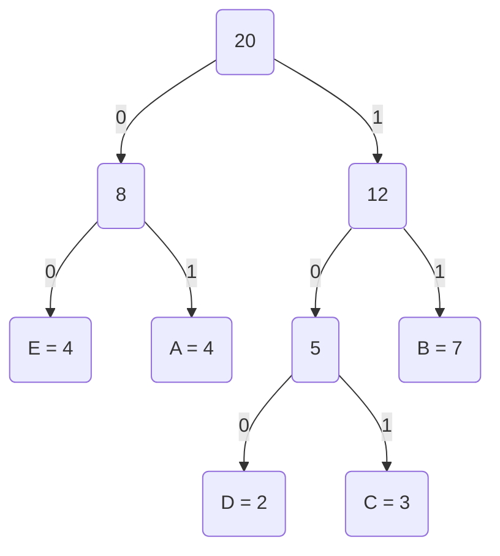

# Huffman Tree

The Huffman Tree is a method for encoding a set of characters into a prefix-free binary code. The method assigns shorter codes to more frequently occurring characters and longer codes to less frequently occurring characters, such that the average length of the code is minimized.

## Algorithm

The algorithm starts by initializing a leaf node for each character in the input set and setting its weight equal to the frequency of the character. It then builds a binary tree by repeatedly combining the two nodes with the lowest weight into a new internal node, until all nodes have been combined into a single tree. Finally, the binary code for each character is determined by traversing from the root to the leaf node and assigning 0 to left branches and 1 to right branches.

Here is the **pseudocode** for the algorithm:

```less
// Step 1: Create a priority queue to hold each character and it's frequency.
for each unique character c in input string:
    add(c, frequency of c) to the priority queue

// Step 2: Build the Huffman Tree.
while priority queue has more than one element:
    - remove the two element with the lowest frequencies from the priority queue.
    - create a new node that is the parent of the two removed nodes, with frequency equal to the sum of their frequencies.
    - add the new node back to the priority queue.

// Step 3: Traverse the Huffman Tree and assign binary codes to each character.
assign a 0 bit to each left branch of the tree, and a 1 bit to each right branch.

for each character c in the input string:
    - traverse the Huffman tree from the root to the leaf node corresponding to c.
    - record the binary code as the sequence of 0's and 1's encountered during traversal.

// Step 4: Encode the binary string using the binary code.
for each character c in the input string:
    write out the binary code for c

// Step 5: Decode the binary string back into the original string.
starting from the root of the Huffman tree:
    for each bit b in the binary string:
        - If b is 0 follow the left branch of the tree.
        - If b is 1 follow the right branch of the tree.
        - If the current node is a leaf, write out the character and return to the root.
```

An **alternative pseudocode** for the algorithm:

```less
1. Create a leaf node for each character and initialize its frequency.
2. Build a priority queue to store the nodes and sort them by their frequency.
3. While there is more than 1 node in the queue:
    - Dequeue the 2 nodes with the lowest frequency.
    - Create a new internal node with those 2 nodes as children and with frequency equal to the sum of the 2 nodes frequency.
    - Enqueue the new node.
4. The remaining node is the root of the Huffman Tree, and the binary code for each character can be determined by traversing from the root to the leaf node.
```

## Example and Diagram

- Given Input String:
```less
"ABBCDBCCDAABBEEEBEAB" - Lenght: 20
```

- Table

| Characters | A     | B     | C     | D     | E     |
| :--------: | :---: | :---: | :---: | :---: | :---: |
| Frequency  | 4     | 7     | 3     | 2     | 4     |

- Sorting them according to their frequncies in a priority queue:

| Characters | D     | C     | E     | A     | B     |
| :--------: | :---: | :---: | :---: | :---: | :---: |
| Frequency  | 2     | 3     | 4     | 4     | 7     |

- Huffman Tree:



## Use Cases

Huffman Tree has various use cases in different domains. Here are some examples:

- **Data Compression:** The Huffman Tree algorithm can be used for data compression by assigning shorter codes to more frequently occurring characters and longer codes to less frequently occurring characters. This results in a compressed file size with minimal loss of data.

- **Encryption:** The Huffman Tree algorithm can be used for encryption by assigning unique binary codes to each character in the message. The encrypted message can only be decoded using the same Huffman Tree used for encryption.

- **Error Correction:** The Huffman Tree algorithm can be used for error correction by assigning longer codes to characters with more redundancy. This allows the receiver to correct any errors in the transmitted message.

## Proof Of Correctness

The correctness of Huffman Tree can be proved using the following steps:

- **Initialization**
    - At the start of the algorithm, we have a set of n characters, and we initialize the Huffman tree by n leaf nodes with weights equal to the frequency of each character.

**Loop Invariant:** At the beginning of each iteration, we have a set of K nodes that have not been combined into a tree, where K is the number of iterations completed so far.

- **Maintenance**
    - In each iteration of the algorithm, we combine the two nodes with the smallest weights into a single node, which becomes the parent of the two nodes. The weight of the new node is the sum of the weights of the two nodes being combined.

**Loop Invariant:** At the end of each iteration, we have a set of K - 1 nodes that have not been combined into a tree, where K is the number of iterations completed so far.

- **Termination**
    - When all nodes have been combined into a single tree, we have the Huffman Tree, which provides an optimal prefix-free code for the input characters.

The proof of correctness is completed by verifying that the loop invariant holds for all iterations, and that the algorithm terminates with a Huffman tree that satisfies the desired properties.

Therefore, the Huffman tree algorithm is correct, and it produces an optimal prefix-free code for the input characters.
    
## Complexity

Huffman Tree has the following complexity characteristics:    

- **Time Complexity**
    - Building the Huffman Tree requires $\ O(nlog(n)) $ time in the worst case, where n is the number of characters in the input.
    - Encoding and decoding require $\ O(n) $ time, where n is the length of the input text.

- **Space Complexity:**
    - Building the Huffman Tree requires $\ O(n) $ space to store the nodes.
    - Encoding and decoding require $\ O(1) $ space for each character, as the code is generated on the fly.

- **Stability:** Huffman Tree is a stable algorithm, as the order of the characters in the input does not affect the resulting code.

## Conclusion

Huffman Tree is a powerful algorithm for constructing an optimal prefix-free code for a set of characters. It has a wide range of applications in data compression, error correction, and cryptography. The algorithm is easy to understand and implement, and it produces a code that minimizes the average code length, which is an important metric for data compression. Despite its efficiency, the Huffman Tree algorithm has some limitations, such as the requirement to know the frequency of each character in advance, and the lack of adaptability to changes in the input. Nevertheless, it remains a valuable tool for data compression and other applications where optimal prefix-free codes are require